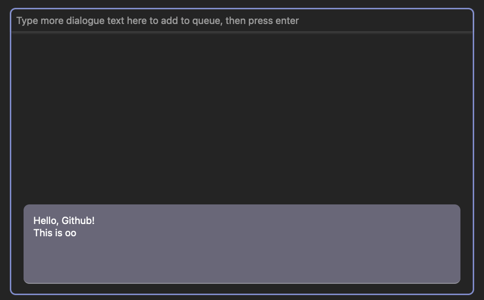

# cutscene

🎥 lightweight text handling for the browser, powers cutscenes with dialogue for [https://oogycanyouhelp.com](https://oogycanyouhelp.com)

🚀 Try the live example here on Github Pages! [https://insanj.github.io/cutscene/example/](https://insanj.github.io/cutscene/example/)



## Install

Built with Typescript, compiled for use in any modern browser through the `OogyCutscene.min.js` file.

```js
import { OogyCutscene } from "OogyCutscene.min.js";
```

```html
<script src="OogyCutscene.min.js"></script>
```

For development or Node.js use:

```bash
npm install oogy-cutscene
```


## Usage

To learn how to use this module, check out [OogyCutscene.ts](src/OogyCutscene.ts), which is full of documentation and comments about how to use the API and what its full capabilities are.

See [example/](example/) as well as the `package.json` command `npm run example` for a demo of it in action. Below, a snippet of the example's [index.html](example/index.html):

```html
<script type="module">
  import { 
    OogyCutscene
  } from "/dist/OogyCutscene.min.js";

  const element = document.getElementById("dialogue");
  const text = "Hello, Github! This is oogy-cutscene, a simple but powerful tool for web-based video games.";
  
  const task = {
    element,
    text
  }; // this is a OogyCutsceneTask, but used in a pure JS context

  const performer = new OogyCutscene.OogyCutscenePerformer();

  console.log("oogy-cutscene example is starting its performance", task, performer);
  performer.perform(performer)
    .then(() => {
      console.log("oogy-cutscene example has finished its performance", performer);
    })
    .catch(e => {
      console.error(e);
    });
</script>
```

## Development

To begin development on this module, clone the repo and run `npm install` to grab all the needed development dependencies. Then, use `npm start` to turn the `src/*.ts` -> `dist/*.js`, then use `npm run release` to turn the `.js` to `.min.js`. See `package.json` to learn how these scripts work.

It can be helpful to make sure your IDE is using the same Typescript version as `package.json`. For example, in Visual Studio Code, open a `.ts` file and use the shortcut SHIFT+COMMAND+P and choose `TypeScript: > Select TypeScript Version...`.


## Author

```
Julian Weiss @insanj
cutscene@oogycanyouhelp.com
github.com/insanj
(c) 2022
```


## License

```
MIT License

Copyright (c) 2022 Julian Weiss

Permission is hereby granted, free of charge, to any person obtaining a copy
of this software and associated documentation files (the "Software"), to deal
in the Software without restriction, including without limitation the rights
to use, copy, modify, merge, publish, distribute, sublicense, and/or sell
copies of the Software, and to permit persons to whom the Software is
furnished to do so, subject to the following conditions:

The above copyright notice and this permission notice shall be included in all
copies or substantial portions of the Software.

THE SOFTWARE IS PROVIDED "AS IS", WITHOUT WARRANTY OF ANY KIND, EXPRESS OR
IMPLIED, INCLUDING BUT NOT LIMITED TO THE WARRANTIES OF MERCHANTABILITY,
FITNESS FOR A PARTICULAR PURPOSE AND NONINFRINGEMENT. IN NO EVENT SHALL THE
AUTHORS OR COPYRIGHT HOLDERS BE LIABLE FOR ANY CLAIM, DAMAGES OR OTHER
LIABILITY, WHETHER IN AN ACTION OF CONTRACT, TORT OR OTHERWISE, ARISING FROM,
OUT OF OR IN CONNECTION WITH THE SOFTWARE OR THE USE OR OTHER DEALINGS IN THE
SOFTWARE.
```